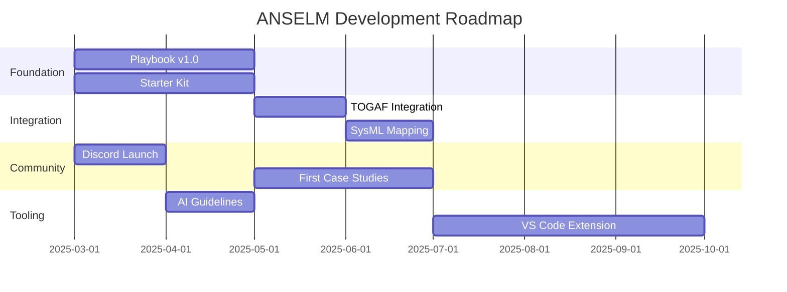

# KC-005: Recommendations — ANSELM Development Proposals

> **Type:** Strategic Recommendations  
> **Status:** Final  
> **Author:** Claude (AI Co-Pilot)  
> **Date:** 2025-02  
> **Tags:** `#anselm` `#recommendations` `#roadmap` `#improvement`

---

## 1. Executive Summary

Based on practical application of ANSELM in this project, I propose **5 key development directions**:

1. **Operationalization** — Playbook with concrete steps
2. **Integration Story** — How ANSELM works with TOGAF/SysML/SAFe
3. **Tooling Ecosystem** — Starter kit and community tools
4. **AI Collaboration Guidelines** — Best practices for working with AI
5. **Community Building** — Forum, case studies

---

## 2. Proposal 1: ANSELM Playbook

### 2.1 Problem

The manifesto says "what" and "why", but not "how". Practitioners need recipes.

### 2.2 Solution

Create **ANSELM Playbook** — an operational guide with:

```text
ANSELM Playbook
├── Quick Start (30 min)
│   ├── Setup: Editor + AI + Mermaid
│   ├── First Session: Template prompts
│   └── First Output: Knowledge Cell
│
├── Daily Practices
│   ├── Morning: Context loading
│   ├── Working: Reasoning loop
│   └── Evening: Knowledge capture
│
├── Project Lifecycle
│   ├── Inception: Raw Ingestion patterns
│   ├── Elaboration: Iterative deepening
│   ├── Construction: View generation
│   └── Transition: Knowledge handoff
│
└── Patterns & Anti-patterns
    ├── ✅ Do: Start with questions
    ├── ❌ Don't: Jump to diagrams
    └── ⚠️ Watch: Context overflow
```

### 2.3 Priority

**P1 (Critical)** — Without this, ANSELM remains inspiration, not practice.

---

## 3. Proposal 2: Integration Matrix

### 3.1 Problem

Architects work in environments with existing frameworks. They don't know how ANSELM integrates with them.

### 3.2 Solution

"ANSELM + X" section:

| Framework | Relationship with ANSELM | Guidance |
| --------- | ------------------------ | -------- |
| **TOGAF** | ANSELM as reasoning layer over ADM | Phase A-D: ANSELM; Phase E-H: TOGAF |
| **SysML** | SysML as formal view from ANSELM knowledge | Generate SysML from Knowledge Cells |
| **ArchiMate** | ArchiMate as visualization layer | Export to ArchiMate via Mermaid |
| **SAFe** | ANSELM in PI Planning, Enabler Epics | Align Knowledge Cells with Features |
| **Agile/Scrum** | ANSELM in Refinement, Sprint Planning | Knowledge Cell per User Story |

### 3.3 Priority

**P2 (Important)** — Will enable enterprise adoption.

---

## 4. Proposal 3: Starter Kit

### 4.1 Problem

Lack of tools = high entry barrier.

### 4.2 Solution

**ANSELM Starter Kit** (GitHub repo):

```text
anselm-starter-kit/
├── README.md
├── templates/
│   ├── knowledge-cell.md
│   ├── reasoning-session.md
│   ├── decision-record.md
│   └── project-canvas.md
│
├── prompts/
│   ├── raw-ingestion.txt
│   ├── trade-off-analysis.txt
│   ├── coherence-check.txt
│   └── view-generation.txt
│
├── vscode/
│   ├── settings.json
│   ├── snippets.json
│   └── extensions.json
│
└── examples/
    └── case-studies/
```

### 4.3 Priority

**P2 (Important)** — Will lower entry barrier from days to hours.

---

## 5. Proposal 4: AI Collaboration Guidelines

### 5.1 Problem

The manifesto says "AI as co-pilot" but not how to collaborate effectively and safely.

### 5.2 Solution

Document "Working with Your AI Co-Pilot":

#### A. When to Trust AI

| AI Output | Trust Level | Verification |
| --------- | :---------: | ------------ |
| Text synthesis | ✅ High | Spot-check key facts |
| Architectural proposals | ⚠️ Medium | Peer review, domain expert |
| Cost estimates | ⚠️ Low | Validate with vendors |
| Technical facts | ⚠️ Medium | Cross-reference documentation |
| Final decisions | ❌ Never | Always human-in-the-loop |

#### B. Red Flags (Hallucination Indicators)

- AI gives very specific numbers without source
- AI "quotes" documents you didn't provide
- AI is overly confident in uncertain areas
- AI doesn't admit to not knowing

#### C. Effective Prompting Patterns

| Pattern | Example |
| ------- | ------- |
| **Devil's Advocate** | "Find 5 reasons why this architecture will fail" |
| **Alternative Forcing** | "Propose 3 different approaches, not just one" |
| **Constraint Testing** | "What happens if we remove constraint X?" |
| **Assumption Surfacing** | "What assumptions are implicit in this design?" |

### 5.3 Priority

**P2 (Important)** — Will prevent over-trust and disappointments.

---

## 6. Proposal 5: Community Building

### 6.1 Problem

ANSELM is a lonely website. Practitioners have nowhere to:

- Ask questions
- Share experiences
- See case studies
- Learn from others

### 6.2 Solution

**ANSELM Community Roadmap:**

| Element | Effort | Impact | Timeline |
| ------- | :----: | :----: | :------: |
| GitHub Discussions | Low | Medium | Month 1 |
| Discord Server | Low | High | Month 1 |
| Case Study Template | Medium | High | Month 2 |
| Monthly Office Hours | Medium | Medium | Month 3 |
| Annual Conference | High | High | Year 2 |

### 6.3 Priority

**P1 (Critical)** — Community = sustainability.

---

## 7. Roadmap Summary



---

## 8. Priority Summary

| Proposal | Priority | Effort | Impact |
| -------- | :------: | :----: | :----: |
| **Playbook** | P1 | Medium | High |
| **Community** | P1 | Low | High |
| **Integration Matrix** | P2 | Medium | Medium |
| **Starter Kit** | P2 | Medium | High |
| **AI Guidelines** | P2 | Low | Medium |

**Recommendation:** Start with Playbook + Community (P1), then Starter Kit + AI Guidelines (P2).

---

*Complexity seeking clarity.*
