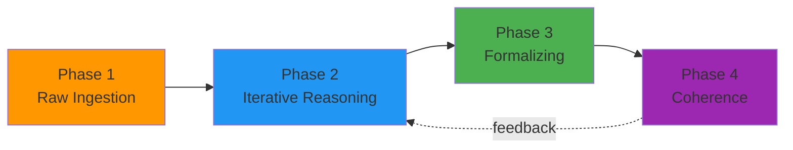

# ANSELM Playbook — Operational Guide

> **Version:** 1.0  
> **License:** CC BY-SA 4.0  
> **Based on:** [anselm.ing](https://anselm.ing)

---

## ⚠️ Before You Begin: The Essential Warning

**This Playbook is a tool, not a ritual.**

The moment you start following these steps *because they're the steps* rather than *because they help you think*, ANSELM has failed.

| If you're doing this... | ANSELM is working |
| ----------------------- | :---------------: |
| Using templates to capture genuine insights | ✅ |
| Skipping steps that don't apply | ✅ |
| Adapting patterns to your context | ✅ |
| Arguing about "correct" KP format | ❌ |
| Filling templates to satisfy audits | ❌ |
| Following phases in order "because Playbook says so" | ❌ |

**The only valid measure of success:** *Do you understand your system better than before?*

There is no ANSELM certification. There never will be. If someone offers you one, they have not understood ANSELM.

---

## Table of Contents

1. [Quick Start](#1-quick-start-30-minutes)
2. [Four-Phase Workflow](#2-four-phase-workflow)
3. [Daily Practices](#3-daily-practices)
4. [Prompting Patterns](#4-prompting-patterns)
5. [Templates](#5-templates)
6. [Troubleshooting](#6-troubleshooting)

---

## 1. Quick Start (30 minutes)

### 1.1 Prerequisites

| Tool | Purpose | Recommendation |
| ---- | ------- | -------------- |
| **Editor** | Markdown editing | VS Code + Markdown All in One |
| **AI** | Co-pilot | Claude / GPT-4 / Copilot Chat |
| **Diagrams** | View generation | Mermaid (built into VS Code) |
| **Version control** | Knowledge history | Git |

### 1.2 First Session

**Step 1:** Copy the starter prompt:

```text
You are a systems engineering co-pilot working with the ANSELM approach.
ANSELM principles:
- Knowledge-first: Build understanding before artifacts
- Disposable views: Diagrams are generated from knowledge, not the source
- Continuous coherence: Check consistency at every step
- AI as partner: I can ask questions, propose alternatives, challenge assumptions

Context for analysis:
[PASTE YOUR DOCUMENT/REQUIREMENTS HERE]

Start by building a mental model: stakeholders, constraints, volumes, dependencies.
```

**Step 2:** Paste your raw material (requirements, notes, transcripts)

**Step 3:** Let AI build the "mental model" first, then ask for artifacts

### 1.3 First Output

After 30 minutes you should have:

- [ ] List of identified stakeholders
- [ ] Key constraints extracted
- [ ] At least one Mermaid diagram
- [ ] 3+ open questions for stakeholders

---

## 2. Four-Phase Workflow

### 2.1 Overview



### 2.2 Phase 1: Raw Ingestion

**Goal:** Load "chaos" into AI without imposing structure

**Actions:**

- Paste documents, notes, transcripts
- Don't edit or organize beforehand
- Accept that input will be messy

**Prompts:**

```text
Here is a raw document. Please:
1. Identify who is mentioned (stakeholders)
2. Extract constraints and requirements
3. Note what is unclear or missing
4. Do NOT create diagrams yet
```

**Output:** Mental model, not artifacts

### 2.3 Phase 2: Iterative Reasoning

**Goal:** Explore solution space through conversation

**Actions:**

- Ask "what if" questions
- Request alternatives (always 3+)
- Challenge assumptions
- Let AI ask you questions

**Prompts:**

```text
Propose 3 different architectural approaches for this system.
For each, list: strengths, weaknesses, key risk.
```

```text
What assumptions are implicit in approach A?
What happens if assumption X is false?
```

```text
Act as Devil's Advocate: find 5 reasons why this design will fail.
```

**Output:** Decision options with trade-offs

### 2.4 Phase 3: Formalizing

**Goal:** Generate views from knowledge

**Actions:**

- Request diagrams (Mermaid, PlantUML)
- Create tables, matrices
- Write down decisions in Knowledge Packets

**Prompts:**

```text
Generate a Mermaid context diagram showing:
- System boundary
- External actors
- Key data flows
```

```text
Create a trade-off matrix comparing options A, B, C
across criteria: cost, time, risk, fit.
```

**Output:** Artifacts that can be shared

### 2.5 Phase 4: Coherence Checking

**Goal:** Ensure consistency across all decisions

**Actions:**

- Review all decisions for conflicts
- Check alignment with constraints
- Validate with original requirements

**Prompts:**

```text
Review our session so far. Are there any:
1. Contradictions between decisions?
2. Requirements we haven't addressed?
3. Assumptions that conflict?
```

```text
Check: does our architecture satisfy constraint X?
Show the reasoning chain.
```

**Output:** Validated, coherent knowledge

---

## 3. Daily Practices

### 3.1 Session Start (5 min)

If resuming work:

```text
Context from previous session:
[PASTE SUMMARY OR PREVIOUS KP]

We left off at: [LAST TOPIC]

Continue from where we stopped.
```

### 3.2 During Work

**Every 30-60 minutes:**

- Save key decisions as Knowledge Packets
- Generate a Mermaid diagram to "checkpoint" understanding
- Ask AI: "What have we decided so far? What's still open?"

### 3.3 Session End (10 min)

```text
Summarize this session:
1. Key decisions made
2. Open questions
3. Next steps
4. Context needed for next session

Format as a Knowledge Packet.
```

Save the output to `session-log-YYYY-MM-DD.md`

---

## 4. Prompting Patterns

### 4.1 Pattern: Devil's Advocate

**When:** You have a preferred solution and need validation

```text
I'm leaning towards [SOLUTION].
Act as Devil's Advocate: give me 5 reasons why this is a bad idea.
Be specific and harsh.
```

### 4.2 Pattern: Three Alternatives

**When:** You need options, not just one answer

```text
Don't give me one solution. Propose exactly 3 alternatives:
1. Conservative / safe option
2. Innovative / risky option  
3. Hybrid / balanced option

For each: 1 paragraph description, key trade-off, biggest risk.
```

### 4.3 Pattern: Constraint Pressure Test

**When:** Testing robustness of a design

```text
Our design assumes [CONSTRAINT].
What happens if:
a) Constraint is removed?
b) Constraint is doubled in severity?
c) Constraint changes mid-project?
```

### 4.4 Pattern: Stakeholder Perspective

**When:** You need to see the problem from different angles

```text
View this architecture from the perspective of:
1. End user (usability, experience)
2. Operations team (deployment, monitoring)
3. Security auditor (risks, compliance)
4. Finance controller (cost, ROI)

For each: What would they praise? What would they criticize?
```

### 4.5 Pattern: Knowledge Capture

**When:** Ending a reasoning session

```text
Convert our discussion into a Knowledge Packet with:
- Type: [Decision Record / Analysis / Design Rationale]
- Context: What prompted this discussion
- Decision: What we decided
- Consequences: What follows from this decision
- Alternatives considered: What we rejected and why
```

---

## 5. Templates

Templates are available in the [templates/](templates/) directory:

| Template | Purpose | When to Use |
| -------- | ------- | ----------- |
| [knowledge-packet.md](templates/knowledge-packet.md) | Universal KP | Any knowledge capture |
| [decision-record.md](templates/decision-record.md) | ADR-style | Recording decisions |
| [session-log.md](templates/session-log.md) | Session summary | End of each session |
| [project-canvas.md](templates/project-canvas.md) | One-page overview | Project kickoff |
| [context-transfer.md](templates/context-transfer.md) | Handoff document | New session / new person |

---

## 6. Troubleshooting

### 6.1 Problem: AI gives superficial answers

**Symptom:** One-paragraph responses, generic advice

**Solution:**

```text
Go deeper. I need:
- Specific examples, not general principles
- Trade-offs with numbers or estimates
- At least 3 alternatives considered
```

### 6.2 Problem: Context window overflow

**Symptom:** AI "forgets" earlier parts of conversation

**Solution:**

1. Summarize and restart:

```text
Summarize everything we've decided into a single Knowledge Packet.
I'll use this to start a new session.
```

1. Use Knowledge Packets as "external memory"

### 6.3 Problem: Diagrams don't match knowledge

**Symptom:** Generated diagram misses elements or shows wrong relationships

**Solution:**

```text
The diagram is wrong. The knowledge says:
- [FACT 1]
- [FACT 2]

Regenerate the diagram ensuring these facts are reflected.
```

Remember: Diagrams are disposable. Regenerate, don't patch.

### 6.4 Problem: Going in circles

**Symptom:** Same topics keep coming up without progress

**Solution:**

```text
We seem to be circling. Let's force a decision:
1. List the open question
2. List options (max 3)
3. Pick one now with explicit reasoning
4. Record what would make us revisit this decision
```

### 6.5 Problem: AI hallucinations

**Symptom:** AI states "facts" you didn't provide

**Solution:**

```text
Stop. You just stated [CLAIM].
What is the source of this information?
If you don't have a source, say "I'm speculating" and explain your reasoning.
```

---

## Appendix: ANSELM Principles Summary

| Principle | Implication |
| --------- | ----------- |
| **Knowledge-first** | Understand before diagramming |
| **AI as co-pilot** | Partner, not oracle |
| **Disposable views** | Diagrams are outputs, not sources |
| **Continuous coherence** | Check consistency always |
| **Open ecosystem** | Markdown > proprietary tools |
| **Conversation as process** | Chat history = audit trail |

---

*Complexity seeking clarity.*
