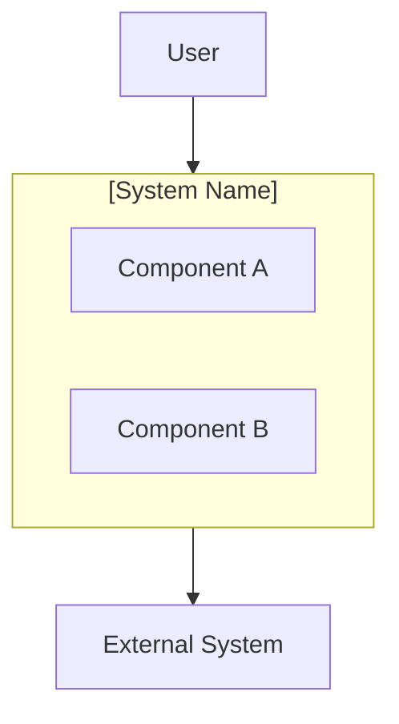

# Project Canvas: [Project Name]

> **Date:** [YYYY-MM-DD]  
> **Version:** [X.Y]  
> **Owner:** [Name]

---

## 1. Purpose

**In one sentence:** [What is this project trying to achieve?]

## 2. Stakeholders

| Role | Name/Group | Interest | Influence |
| ---- | ---------- | :------: | :-------: |
| Sponsor | [Name] | High | High |
| User | [Group] | High | Medium |
| Operator | [Team] | Medium | Medium |
| Regulator | [Body] | Low | High |

## 3. Scope

### 3.1 In Scope

- [Item 1]
- [Item 2]
- [Item 3]

### 3.2 Out of Scope

- [Item 1]
- [Item 2]

## 4. Constraints

| Type | Constraint | Impact |
| ---- | ---------- | ------ |
| Time | [Deadline] | [Effect] |
| Budget | [Amount] | [Effect] |
| Technical | [Limitation] | [Effect] |
| Regulatory | [Requirement] | [Effect] |

## 5. Key Risks

| Risk | Likelihood | Impact | Mitigation |
| ---- | :--------: | :----: | ---------- |
| [Risk 1] | High | High | [Strategy] |
| [Risk 2] | Medium | Medium | [Strategy] |

## 6. Success Criteria

How do we know we succeeded?

- [ ] [Criterion 1]
- [ ] [Criterion 2]
- [ ] [Criterion 3]

## 7. High-Level Architecture

## 8. Key Decisions

| # | Decision | Date | Status |
| - | -------- | ---- | ------ |
| 1 | [Decision] | [Date] | Accepted |

## 9. Knowledge Cells

- [packet-name.md](path/to/packet-name.md) — [Title]

---

*Complexity seeking clarity.*
